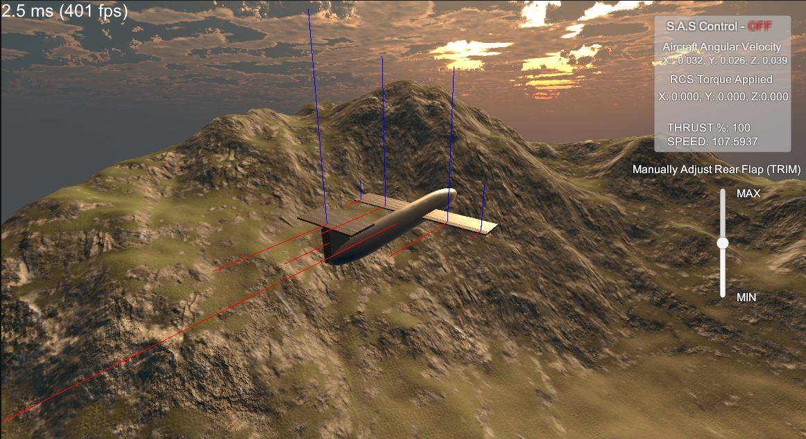

# Flight_Simulator
 
Hello! This is a ‘realistic’ flight simulator with toggleable PID control I developed to gain experience coding in C#. 

If you want to try it out, clone this repository and drag the scene MainScene into your Unity game located at Flight_Simulator/Assets/GameScenes/MainScene. For game controls:
W, A, S, D, E and Q control aircraft rotation, LShift and LControl control engine thrust, and T activates the PID Control System termed S.A.S (Stability Augmentation System).

 

A short clip showcasing the simulator running in real time.

https://user-images.githubusercontent.com/80991754/123162604-cc904580-d43e-11eb-9bcf-5e8b89a1734f.mp4

# Aircraft Physics

Aircraft physics are modelled using [1], which presents equations for the coefficients of lift, drag and pitching moment for an aerodynamic surface given the angles of attack of both the airfoil and it’s associated flap.

[1] W. Khan and M. Nahon, "Real-time modeling of agile fixed-wing UAV aerodynamics," 2015 International Conference on Unmanned Aircraft Systems (ICUAS), 2015, pp. 1188-1195, doi: 10.1109/ICUAS.2015.7152411

# PID Control

By pressing 'T', a proportional (P), integral (I) and derivative (D) controller or stability augmentation system (S.A.S) is activated for each of the aircrafts primary axes: roll, pitch, and yaw. This tuned S.A.S. attempts to limit the crafts angular velocity to 0 using experimentally chosen gain values for Kp, Ki and Kd in each axis. 

To see the PID controller in action, a small example is presented: An aerodynamically unbalanced aircraft is taking off from rest with and without PID control. In this first clip no S.A.S is activated and the aircraft proceeds to flip over upon takeoff.

https://user-images.githubusercontent.com/80991754/123285531-20506c80-d4db-11eb-8db0-cb1e1a9e7f60.mp4

And with S.A.S activated the craft still pitches upward rapidly, but it can overcome the unbalanced aerodynamic forces and keep the craft stable.

https://user-images.githubusercontent.com/80991754/123285695-4544df80-d4db-11eb-8ec6-2f4630be8ac0.mp4

